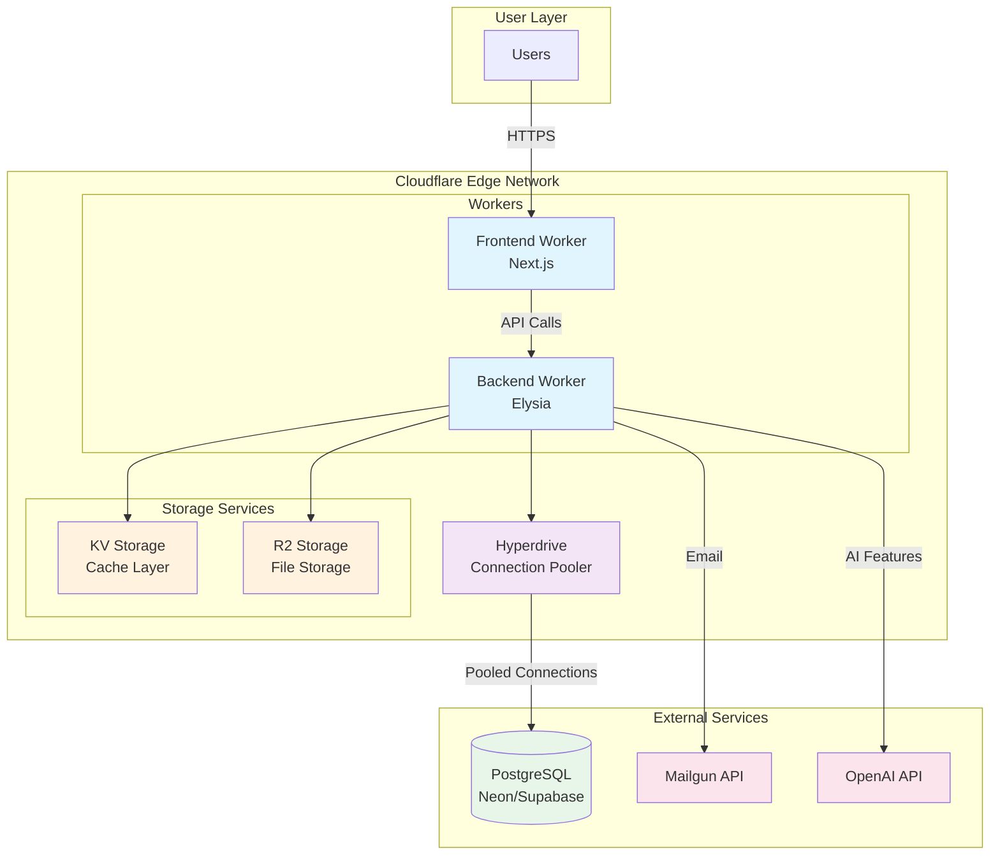

# VerseMate Cloudflare Migration Architecture

## Overview

This document outlines the proposed architecture for migrating VerseMate's backend infrastructure from traditional hosting to Cloudflare's edge computing platform. The migration aims to improve performance, reduce operational complexity, and unify the hosting infrastructure.

## Current Architecture vs Proposed Architecture

### Current Architecture
- **Frontend**: Next.js on Cloudflare Workers
- **Backend**: Elysia (Bun) on separate server
- **Database**: PostgreSQL (external)
- **Cache**: Redis
- **Storage**: AWS S3
- **Email**: Mailgun API

### Proposed Architecture
- **Frontend**: Next.js on Cloudflare Workers (no change)
- **Backend**: Elysia on Cloudflare Workers
- **Database**: PostgreSQL (external) + Hyperdrive
- **Cache**: Cloudflare KV
- **Storage**: Cloudflare R2
- **Email**: Mailgun API (no change)

## Architecture Diagram



## Component Details

### 1. Frontend (No Changes)
- **Technology**: Next.js with Cloudflare Workers adapter
- **Deployment**: Already on Cloudflare Workers
- **Configuration**: `apps/frontend-next/wrangler.jsonc`

### 2. Backend Migration

#### Elysia on Cloudflare Workers
```typescript
// Current Elysia setup (apps/backend/src/index.ts)
const app = new Elysia()
  .use(authPlugin)
  .use(userPlugin)
  .use(biblePlugin)
  .use(cors())
  .use(swagger());

// Proposed Workers setup
export default {
  async fetch(request: Request, env: Env): Promise<Response> {
    return app
      .decorate('env', env)
      .handle(request);
  }
}
```

#### Required Modifications
1. Replace Node.js-specific APIs with Workers equivalents
2. Update entry point for Workers runtime
3. Configure wrangler.toml for backend

### 3. Database Layer

#### Hyperdrive Configuration
```toml
# wrangler.toml
[[hyperdrive]]
binding = "DB"
id = "your-hyperdrive-id"
```

#### Benefits of Hyperdrive
- **Connection Pooling**: Manages database connections efficiently
- **Regional Caching**: Caches query results at edge locations
- **Automatic Retries**: Handles transient failures
- **Connection Reuse**: Reduces latency

#### PostgreSQL Providers Comparison

| Provider | Pros | Cons | Best For |
|----------|------|------|----------|
| **Neon** | • Serverless scaling<br/>• Branching feature<br/>• Good free tier | • Newer service<br/>• Limited regions | Development & small-medium apps |
| **Supabase** | • Additional features<br/>• Good documentation<br/>• Generous free tier | • More expensive at scale<br/>• Feature overhead | Apps needing auth/realtime |
| **AWS RDS** | • Mature service<br/>• Many regions<br/>• Enterprise features | • Higher cost<br/>• Complex setup | Enterprise applications |

### 4. Cache Migration (Redis → KV)

#### Current Redis Usage
```typescript
// Current Redis implementation
import { redis } from './redis-client';
await redis.set('key', 'value', 'EX', 3600);
const value = await redis.get('key');
```

#### Cloudflare KV Implementation
```typescript
// Proposed KV implementation
await env.KV.put('key', 'value', { expirationTtl: 3600 });
const value = await env.KV.get('key');
```

#### Migration Strategy
1. Create abstraction layer for cache operations
2. Implement KV adapter alongside Redis
3. Gradually switch traffic to KV
4. Remove Redis dependency

### 5. Storage Migration (S3 → R2)

#### Benefits of R2
- **S3-compatible API**: Minimal code changes
- **No egress fees**: Cost savings on bandwidth
- **Integrated with Workers**: Better performance
- **Automatic replication**: Global distribution

#### Migration Steps
```typescript
// Current S3 implementation
import { S3Client } from '@aws-sdk/client-s3';

// R2 implementation (minimal changes)
import { S3Client } from '@aws-sdk/client-s3';
// Just update endpoint and credentials
```

### 6. Email Service (No Changes)
- Continue using Mailgun API
- Already using fetch-based implementation
- No changes required

## Migration Plan

### Phase 1: Proof of Concept (Week 1-2)
- [ ] Set up Hyperdrive with existing PostgreSQL
- [ ] Create simple Elysia Worker with one endpoint
- [ ] Test database connectivity and performance
- [ ] Document any compatibility issues

### Phase 2: Core Services (Week 3-4)
- [ ] Migrate authentication endpoints
- [ ] Implement KV cache layer
- [ ] Migrate user management endpoints
- [ ] Set up monitoring and logging

### Phase 3: Full Migration (Week 5-6)
- [ ] Migrate remaining endpoints
- [ ] Set up R2 storage
- [ ] Migrate file upload/download functionality
- [ ] Performance testing and optimization

### Phase 4: Cutover (Week 7)
- [ ] Update DNS and routing
- [ ] Monitor for issues
- [ ] Keep old infrastructure as fallback
- [ ] Document runbooks

## Cost Analysis

### Current Estimated Costs
- Backend hosting: ~$50-100/month
- Redis: ~$20-50/month
- S3: ~$20-30/month
- **Total**: ~$90-180/month

### Cloudflare Estimated Costs
- Workers: ~$5-20/month (pay per request)
- KV: ~$5-10/month
- R2: ~$15-20/month
- Hyperdrive: ~$5/month
- **Total**: ~$30-55/month

**Potential Savings**: 50-70% reduction in infrastructure costs

## Performance Benefits

1. **Global Edge Deployment**
   - Reduced latency (code runs closer to users)
   - Automatic scaling
   - No cold starts (Workers stay warm)

2. **Integrated Services**
   - Reduced inter-service latency
   - Unified platform
   - Better caching strategies

3. **Connection Pooling**
   - Hyperdrive reduces database connection overhead
   - Regional caching for common queries
   - Automatic retry logic

## Risks and Mitigations

| Risk | Impact | Mitigation |
|------|--------|------------|
| Elysia compatibility issues | High | Thorough testing in PoC phase |
| Database connection limits | Medium | Hyperdrive connection pooling |
| KV limitations vs Redis | Low | Design cache strategy for KV model |
| Migration downtime | Medium | Blue-green deployment strategy |

## Monitoring and Observability

### Cloudflare Analytics
- Real-time request metrics
- Error tracking
- Performance monitoring

### Custom Logging
```typescript
// Structured logging for Workers
console.log(JSON.stringify({
  timestamp: new Date().toISOString(),
  level: 'info',
  message: 'Request processed',
  metadata: { userId, endpoint, duration }
}));
```

### Alerts
- Set up Cloudflare alerts for:
  - Error rate spikes
  - Latency increases
  - KV/R2 quota usage

## Security Considerations

1. **Environment Variables**
   - Store sensitive data in Workers secrets
   - Rotate credentials regularly

2. **Database Access**
   - Hyperdrive provides secure connection pooling
   - Use connection string encryption

3. **API Security**
   - Continue using JWT authentication
   - Implement rate limiting at edge

## Conclusion

Migrating VerseMate's backend to Cloudflare Workers is technically feasible and offers significant benefits in terms of performance, cost, and operational simplicity. The architecture leverages Cloudflare's edge network while maintaining compatibility with existing PostgreSQL infrastructure through Hyperdrive.

The phased migration approach minimizes risk and allows for validation at each step. With proper planning and testing, this migration can be completed within 6-7 weeks with minimal disruption to users.

## Next Steps

1. **Approval**: Get stakeholder buy-in for migration
2. **PoC Development**: Start with Phase 1 proof of concept
3. **Provider Selection**: Choose PostgreSQL provider (Neon recommended)
4. **Team Training**: Ensure team is familiar with Cloudflare Workers

## Resources

- [Cloudflare Workers Documentation](https://developers.cloudflare.com/workers/)
- [Hyperdrive Documentation](https://developers.cloudflare.com/hyperdrive/)
- [Elysia Documentation](https://elysiajs.com/)
- [Migration Best Practices](https://developers.cloudflare.com/workers/platform/migrations/)